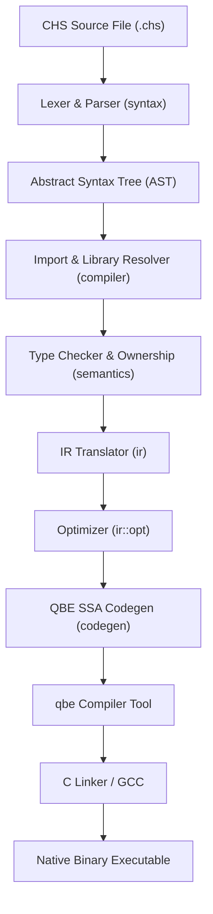

# CHS Compiler Architecture

CHS is a programming language compiler written in Rust that compiles CHS source code to native executables via a QBE Intermediate Representation backend.

## Overview / Context

The compilation process translates high-level CHS code into optimized native binaries. The entire execution pipeline runs sequentially through the following stages:

1. **Source Input**: The compiler takes path arguments representing module files and loads their raw string contents.
2. **Lexing & Parsing**: The `lex-just-parse` crate tokenizes and parses source files into an Abstract Syntax Tree (AST).
3. **Import Resolution**: The compiler recursively resolves all imported modules, matching relative paths and directory locations under the standard library (`std`).
4. **Type Checking & Semantic Analysis**: A two-pass validation routine infers types, resolves signatures, unifies constraints, and validates **drop safety**.
5. **IR Translation**: The typed AST is flattened into a linear Intermediate Representation (IR) consisting of basic blocks and control-flow instructions.
6. **IR Optimization**: A series of optimization passes are applied, including constant folding, dead instruction elimination, unreachable block elimination, and function stripping.
7. **QBE Transpilation**: The optimized IR module is transpiled into QBE SSA assembly code.
8. **Binary Assembly & Linking**: The `qbe` tool translates the SSA code into target-specific assembly (`.s`), which the system C compiler (`gcc`) links against standard libraries and the runtime to produce the final executable.

> [!IMPORTANT]
> The compiler targets the **QBE Intermediate Language** instead of LLVM. This choice keeps the compiler codebase lightweight, optimizes compile speeds, and outputs readable assembly.

---

## Detailed Steps / Components

The compilation pipeline is divided across specialized crates matching their phase in the lifecycle:

| Crate | Primary Responsibility | Key Files / Structs |
| :--- | :--- | :--- |
| **`cli`** | Parses command-line inputs and initiates build processes. | `main.rs` |
| **`compiler`** | Orchestrates compilation, resolves modules, and runs the linker. | `lib.rs` |
| **`syntax`** | Performs lexical analysis, parsing, and AST definition. | `ast.rs`, `lib.rs` |
| **`semantics`** | Resolves types, checks scopes, and tracks drop safety. | `typecheck.rs` |
| **`types`** | Manages primitive types, structs, enums, signatures, and unification. | `lib.rs` |
| **`diagnostic`** | Captures, accumulates, and prints compilation errors with line locations. | `lib.rs` |
| **`ir`** | Emits flat block representation, translates expressions, and runs optimizations. | `translate.rs`, `opt.rs` |
| **`codegen`** | Generates QBE SSA code and reflection metadata. | `qbe.rs` |

### Pipeline Components Detailed Breakout

#### 1. CLI Execution (`cli`)
- Parses subcommand flags: **`build`**, **`run`**, **`clear`**, and **`version`**.
- Sets target output filenames, include paths, verbose logs, and optimization levels (O1, O2, O3).
- Uses `temp_dir` to compile and immediately run code under the `run` command.

#### 2. Process Orchestration (`compiler`)
- Configures search paths for custom directories and default libraries (e.g. `./std`, `./std/runtime`).
- Implements `CompilerProcess::compile`, handling the state transition from AST parsing to linking.
- Links final outputs using the system C compiler (`gcc` or override via `$CC`), incorporating static and dynamic foreign libraries.

#### 3. Lexing & Parsing (`syntax`)
- Uses parser combinators to build a recursive-descent parser.
- Identifies custom keywords such as `defer`, `autocast`, `new`, `make`, and `drop`.
- Builds structured representations of statements (`Stmt`), expressions (`Expr`), and declarations (`FileItem`).

#### 4. Type Checking & Ownership (`semantics`)
- Runs a **two-pass type check**: Pass 1 registers all structure, enum, and function signatures. Pass 2 type-checks statement bodies.
- Enforces **memory drop safety**: Tracks allocation paths, scope boundaries, and stack-backed storage in `owned_vars`. Prevents double-drops and dropping of temporaries or stack values.

> [!NOTE]
> Static drop safety analysis prevents dropping stack-backed memory (like initializers or standard local arrays). Only runtime-allocated structures (pointers, dynamic arrays, slices) can be dropped.

#### 5. Type System & Database (`types`)
- Employs a unified **Type Database** to map types to simple, copyable `TypeID` integers.
- Provides type unification (`type_db.unify`) to resolve type inference variables and coerce compatible types.

#### 6. Diagnostics (`diagnostic`)
- Exposes a `DiagnosticReporter` that aggregates diagnostic messages throughout syntax and type-checking.
- Stores coordinates mapping errors directly to source file coordinates (`Loc`).

#### 7. Intermediate Representation (`ir`)
- Converts AST nodes into a flat instruction set based on Basic Blocks (`BasicBlock`).
- Performs key **optimizations**:
  - **Constant Folding**: Simplifies literal operations at compile time.
  - **Unreachable Block Elimination**: Safely strips unused execution branches.
  - **Dead Instruction Elimination**: Cleans up instructions whose results are never read.
  - **Unused Function Stripping**: Prunes unused functions to shrink the binary footprint.

#### 8. Code Generation (`codegen`)
- Implements `QbeTranspiler` to translate the flattened IR instructions to standard QBE SSA format.
- Generates **type reflection metadata** allowing the CHS runtime library to query types at runtime.

---

## Key Dependencies / Related Notes

- **[[Syntax and AST]]**: Specification of grammatical parser rules and structural AST node types.
- **[[Type Checking and Semantics]]**: Information on the unification engine, type coercion rules, and function signatures.
- **[[Memory Management and Drop Safety]]**: Explains scope boundary checks, stack vs heap allocation rules, and drop verification logic.
- **[[IR and Optimizations]]**: Internal documentation on basic block generation, SSA representation, and optimization algorithms.
- **[[QBE Code Generation]]**: Notes detailing instruction-to-QBE mappings and structure alignment rules.
- **[[Standard Library]]**: Documentation on compiler builtins, standard library modules, and runtime structures.
- **[[Testing and Development Workflow]]**: Documentation on the `runtest.py` test suite runner and `-Fdevelopment` Cargo build feature.
- **`lex-just-parse`**: Parser library facilitating lexical analysis.
- **`qbe` toolchain**: External executable dependency converting `.ssa` files into platform assembly.
- **`gcc`**: Linker backend resolving standard runtime assemblies and building the final target executable.
