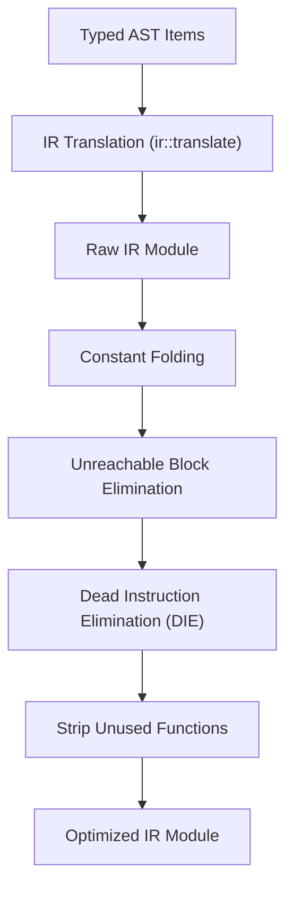

# IR and Optimizations

The Intermediate Representation (IR) translates the AST into flat basic blocks and applies optimization passes to remove dead code and redundant operations.

## Overview / Context

The `ir` crate processes the type-checked AST and outputs a lower-level, control-flow graph (CFG) representation. This flat structure makes instruction analysis and backend generation straightforward:

- **Flat Instruction Blocks**: High-level nested AST loops and conditionals are translated into flat instruction chains inside `BasicBlock` containers.
- **SSA-like Design**: Computations assign values to unique instruction identifier indexes, simplifying dependency tracking.
- **Sequential Optimization Passes**: An orchestration function runs four sequential passes to simplify expressions, prune blocks, clean unused variables, and prune functions.

---

## Detailed Steps / Components

### IR Structural Elements

The IR module layout mirrors a standard compiler compiler back-end structure:

- **`Module`**: Top-level container representing the compiled program, holding structures, globals, and functions.
- **`Function`**: Encapsulates signature information, entry block indexes, instructions, and blocks.
- **`BasicBlock`**: A straight sequence of instruction IDs (`InstId`) ending in a terminator jump/branch.
- **`Instruction`**: Represents basic operations (Alloca, Store, Load, Add, Mul, Br, CondBr, Call).

### The Optimization Pipeline (`opt.rs`)

The compiler applies the following optimization passes in order:

| Optimization Pass | Operation | Key Action |
| :--- | :--- | :--- |
| **Constant Folding** | `fold_constants` | Evaluates arithmetic on literal inputs at compile-time (e.g. `2 + 3` becomes `5`). |
| **Unreachable Block Elimination** | DFS traversal | Traces block execution paths starting at the entry block. Safely removes blocks with no active predecessors. |
| **Dead Instruction Elimination (DIE)** | Liveness tracking | Traces instruction outputs. Strips instructions whose results are never read, unless they have side effects (like calls). |
| **Unused Function Stripping** | `strip_unused_functions` | Identifies reachable functions starting from the `main` entry point. Drops uncalled functions. |

> [!TIP]
> Unreachable block elimination adjusts target jump identifiers in branch instructions to ensure target block mappings remain valid.

---

## Key Dependencies / Related Notes

- **[[CHS Compiler Architecture]]**: The compiler workflow context.
- **[[QBE Code Generation]]**: Mapping optimized IR structures directly to QBE SSA assembly code.
