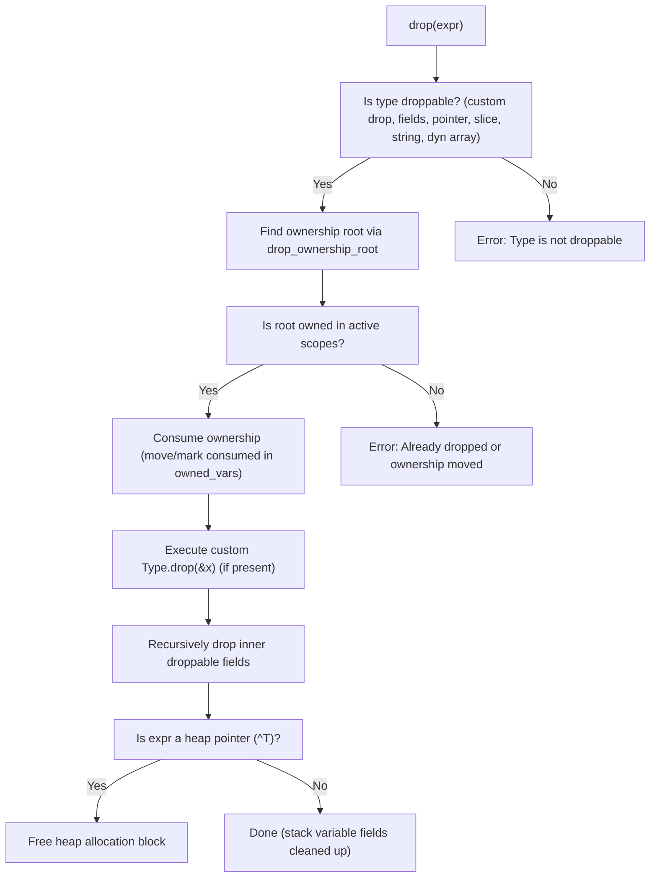

# Memory Management and Drop Safety

Memory management and drop safety enforce compile-time rules to prevent leaks, double-drops, and invalid drops of stack memory.

## Overview / Context

The CHS compiler divides storage structures into stack-backed variables and runtime-managed heap allocations. The compiler implements static analysis checks to guarantee safety:

- **Stack-Backed Allocations**: Literals, inline initializer lists, and standard local arrays are allocated directly on the stack. Stack variables containing custom destructors or droppable fields can execute teardown stages during `drop(x)`, but their stack storage is not deallocated.
- **Heap Allocations & Universal `make`**: Pointers (`^T`), slices (`[]T`), dynamic arrays (`[dyn]T`), strings, and struct/enum instances allocated via `make` represent runtime-owned allocations.
- **Ownership Scope Tracking & RAII**: The compiler maintains `owned_vars` aligned with lexical scope blocks. Ownership moves on assignment (`y = x`) or pass-by-value. At block scope exit, the compiler automatically inserts RAII `drop` calls for any remaining owned variables.
- **Multi-Stage `drop`**: Universal `drop(x)` invokes custom `TypeName.drop(&x)` first (if present), recursively drops child droppable fields, and finally frees heap memory if `x` is a heap pointer (`^T`). See **[[Universal-Make-And-Drop-Memory-System]]**.

> [!WARNING]
> Dropping a resource twice (double-drop), using a variable after ownership move, or dropping an unowned temporary variable triggers compile-time static failures.

---

## Detailed Steps / Components

### The Drop Verification & RAII Process

The drop validation is split into two phases:

#### 1. Semantic Pass (`semantics::typecheck`)
- **Type Compatibility Check**: Validates that the underlying type is droppable (`is_droppable_type`), which includes pointers, slices, dynamic arrays, strings, or structs/enums with custom `drop` methods or droppable fields.
- **Move Analysis & Stack Memory Check**: Tracks variable ownership moves (`y = x`). Verifies that stack storage deallocation is not attempted, but permits field/destructor cleanup on stack variables.

#### 2. IR Translation Pass (`ir::translate`)
- **Ownership Root Resolution & Consumption**: Extracts the base variable identifier (`drop_ownership_root`). Consumes ownership from `owned_vars`.
- **Multi-Stage Code Lowering**:
  1. Emits call to custom destructor `TypeName.drop` if bound.
  2. Emits recursive field drop instructions for struct members.
  3. Emits `runtime.chs_free` for heap pointers (`^T`).
- **RAII Scope Exit Cleanup**: Automatically inserts multi-stage drop sequences for unconsumed owned variables when leaving a lexical scope block.

---

## Key Dependencies / Related Notes

- **[[Universal-Make-And-Drop-Memory-System]]**: Architectural decision detailing universal constructor `make` and destructor `drop`.
- **[[CHS Compiler Architecture]]**: The compiler workflow structure.
- **[[Type Checking and Semantics]]**: The type system that maps droppable and unified type handles.

