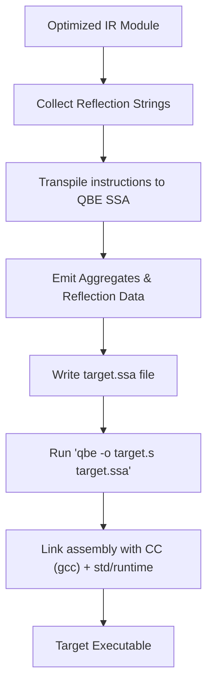

# QBE Code Generation

The QBE code generation backend converts optimized IR modules into QBE SSA assembly syntax and generates runtime type reflection data.

## Overview / Context

The `codegen` crate acts as the backend for the CHS compiler. It translates high-level CHS IR operations into standard QBE Intermediate Language syntax:

- **QBE SSA Translation**: Maps flat IR instructions to QBE instructions. Maps types to QBE's basic types (`w` word, `l` long, `s` single, `d` double, and aggregate structures).
- **Reflection Metadata Generation**: Scans referenced types, emitting string representations and structural properties as read-only constants. This allows the CHS runtime to verify types dynamically.
- **Linker Assembly**: Outputs a `.ssa` file, invokes the `qbe` command to generate a platform-specific assembly file (`.s`), and runs `gcc` to link against dependencies and runtime archives.

> [!IMPORTANT]
> The final binary relies on the CHS runtime library (`libchs_runtime.a` / `libchs_runtime.so` in `std/runtime`) to supply memory management functions, assertions, and reflection primitives.

---

## Detailed Steps / Components

### QBE Type Transpilation Rules

The `QbeTranspiler` translates CHS type models into equivalent QBE structures:

- **Scalar Types**: Map directly to QBE machine registers:
  - `int` and `u8` map to `w` (32-bit word).
  - `usize`, `string`, and pointers map to `l` (64-bit long).
  - `float` maps to `d` (64-bit double).
- **Aggregates (Structs / Arrays)**: Emitted as QBE `type` declarations describing the exact memory offset layout and alignment requirements.

### Codegen and Linking Stages

| Stage | Action | Executing Tool / Code |
| :--- | :--- | :--- |
| **QBE Transpilation** | Emits SSA commands, branches, and blocks to string. | `QbeTranspiler::transpile` |
| **Assembly Generation** | Compiles SSA code into assembly instructions. | `qbe -o target.s target.ssa` |
| **Binary Linkage** | Links target assembly and libraries into an executable. | `gcc target.s -o target -lchs_runtime` |

> [!TIP]
> The linker phase passes additional C compiler optimization levels (e.g., `-O1`, `-O2`, `-O3`), configures search paths (`-I`, `-L`), and links external packages defined inside the code.

### Reflection Metadata Generation

Reflection metadata constants are generated dynamically by the code generator:
- **Layout-Driven Serialization**: Instead of using hardcoded struct alignments or field offsets, the code generator looks up reflection structures (`TypeInfo`, `TypeField`, `TypeEnumVariant`) in the parsed type database and computes their exact memory layouts using `StructLayout::compute`.
- **Dynamic Field Padding**: The emitter loops through the struct fields in order, writing their values (using size-appropriate QBE directives: `b`, `w`, or `l`) and inserting zero-padded bytes (`z N`) dynamically for any alignment gaps.
- **Offset Independence**: Changes to the field names, order, or types of reflection structures in `reflect.chs` are automatically compiled correctly without requiring any modifications to the Rust compiler backend.

---

## Key Dependencies / Related Notes

- **[[CHS Compiler Architecture]]**: Pipeline orchestration summary.
- **[[IR and Optimizations]]**: Source IR definitions that are compiled to QBE.
- **QBE Tool**: The external backend assembler compiling SSA intermediate files.
- **GCC compiler**: System compiler performing native linker linkage.
