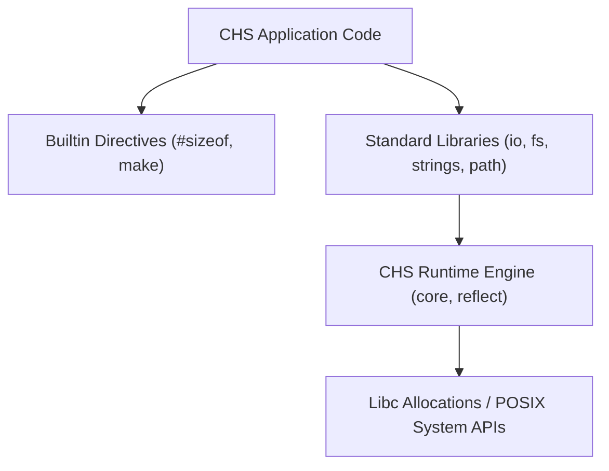

# Standard Library

The CHS standard library offers built-in operators, dynamic memory tracking, reflection structures, file system support, path manipulation, and formatting utilities.

## Overview / Context

The `std` directory houses both the language builtins (which compile down directly to backend operations) and core runtime archives. The library is logically divided into three layers:

1. **Compiler Builtins (`builtin`)**: Lowered operators and directives processed directly during compilation rather than being linked as user functions.
2. **Core Runtime (`runtime`)**: A mixed C and CHS archive managing memory allocations, dynamic array resizing, type reflections, and liveness drops.
3. **Core Utility Modules**: High-level libraries providing wrappers and algorithms for I/O, strings, mathematics, filesystem, paths, and raw C bindings.

> [!NOTE]
> The compiler auto-injects standard search paths pointing to `std/` and `std/runtime` during the import resolution phase.

---

## Detailed Steps / Components

### 1. Compiler Builtins (`builtin.chs`)

Builtins are language primitives and directives handled directly by the typechecker and generator.

#### Builtin Functions
- **`make(T, args...)`**: Universal constructor (see **[[Universal-Make-And-Drop-Memory-System]]**). Heap-allocates single instances `make(T)` returning `^T`, heap-allocates slices `make([]T, n)` or dynamic arrays `make([dyn]T, n)`, constructs stack values `make(TypeName, args...)` via custom `TypeName.make`, or heap-allocates pointer `make(^TypeName, args...)`. *(Note: `new(T)` is deprecated and absorbed into `make(T)`)*.
- **`drop(x)`**: Universal destructor. Executes multi-stage teardown: custom `TypeName.drop(&x)`, recursive field drops, and heap freeing for heap pointers `^T`.
- **`push(da, elems...)`**: Appends elements or slices to a dynamic array pointer.
- **`pop(da)`**: Removes and returns the last element of a dynamic array.
- **`clear(da)`**: Resets a dynamic array length to 0 (retains capacity).

#### Compile-Time Directives
- **`#sizeof(T)` / `#alignof(T)`**: Computes type properties in bytes at compile-time.
- **`#type_info(T)`**: Retrieves a runtime pointer to type metadata.
- **`#anycast[expr]`**: Wraps expressions in generic `Any` type boxes.
- **`#default`**: Initializes a type to its default zero value.
- **`#distinct`**: Creates incompatible distinct types rather than mere aliases.

---

## 2. Standard Types & Method Implementation Syntax

Standard library types use receiver method syntax (`fn (self: ^Receiver) method_name(...)`):

### `File` Struct (`std/fs/fs.chs` & `std/io/fs/fs.chs`)
- `fn (file: ^File) close() -> bool`: Closes handle and resets state.
- `fn (file: ^File) read(buffer: ^void, size: int) -> int`: Reads up to `size` bytes.
- `fn (file: ^File) read_all() -> string #owned_return`: Reads content to EOF into a heap-allocated string.
- `fn (file: ^File) write(buffer: ^void, size: int) -> int`: Writes raw bytes.
- `fn (file: ^File) write_str(content: string) -> int`: Writes string content.
- `fn (file: ^File) seek(offset: int, whence: Whence) -> bool`: Repositions file offset.
- `fn (file: ^File) tell() -> int`: Returns current offset.
- `fn (file: ^File) flush() -> bool`: Flushes buffered data.

### `Path` Struct (`std/path/path.chs`)
Inspired by Rust's `std::path::Path` / `PathBuf`:
- **Constructor**: `fn path.from_string(p: string) -> Path`
- `fn (self: Path) string() -> string` / `fn (self: Path) str() -> string`: Returns raw path string.
- `fn (self: Path) is_empty() -> bool` & `fn (self: Path) len() -> usize`: Length / emptiness inspection.
- `fn (self: Path) is_absolute() -> bool` & `fn (self: Path) is_relative() -> bool`: Absolute vs relative checks.
- `fn (self: Path) file_name() -> string` & `fn (self: Path) base_name() -> string`: Base component.
- `fn (self: Path) parent() -> string`: Parent directory component.
- `fn (self: Path) extension() -> string`: File extension.
- `fn (self: Path) join_path(other: string) -> Path #owned_return`: Joins paths cleanly into a new `Path`.
- `fn (self: ^Path) append(other: string)`: Appends path component in-place.
- `fn (self: Path) exists() -> bool`: Queries filesystem liveness.

### `StringBuilder` Struct (`std/strings/strings.chs`)
- `fn (b: ^StringBuilder) write_char(c: u8)`: Appends byte character.
- `fn (b: ^StringBuilder) write_string(s: string)`: Appends string contents.
- `fn (b: ^StringBuilder) to_string() -> string #owned_return`: Builds string.
- `fn (b: ^StringBuilder) destroy()`: Deallocates buffer.

---

### 3. Utility Modules

| Module | Core Functionality | Key APIs |
| :--- | :--- | :--- |
| **`io`** | Type-reflective console output. | `print(fmt, args...)`, `puts(str)` |
| **`fs`** | File operations and block reads. | `File` struct methods, `open`, `read_to_string`, `write_string`, `append_string`, `file_exists`, `remove_file` |
| **`path`** | File system path object and functions. | `Path` struct methods, `base`, `dir`, `ext`, `join`, `from_string` |
| **`strings`** | String inspection, accumulation, and transformation. | `StringBuilder` methods, `to_lower`, `to_upper`, `repeat`, `join`, `count`, `is_hex_digit`, `is_printable` |
| **`math`** | Exposes floating-point and integer math. | Binds `libm` functions (`sqrt`, `sin`, `pow`), Abs, Min/Max |
| **`mem`** | Raw memory mutations and slice utilities. | `copy`, `move`, `set`, `zero`, `clone`, `contains_u8`, `index_of_u8`, `reverse_bytes` |
| **`libc`** | Low-level C library binds. | Standard C memory and file descriptor allocations |

---

## Key Dependencies / Related Notes

- **[[CHS Compiler Architecture]]**: Flow context of standard library linking.
- **[[Type Checking and Semantics]]**: Semantic rules governing type resolution and method lookups.
- **[[Method Implementation Integration]]**: Receiver method syntax and cross-module lookups.
- **[[Memory Management and Drop Safety]]**: Static analysis rules for `drop` and heap allocations.
- **[[QBE Code Generation]]**: Details on QBE aggregate layout and reflection metadata generation.
