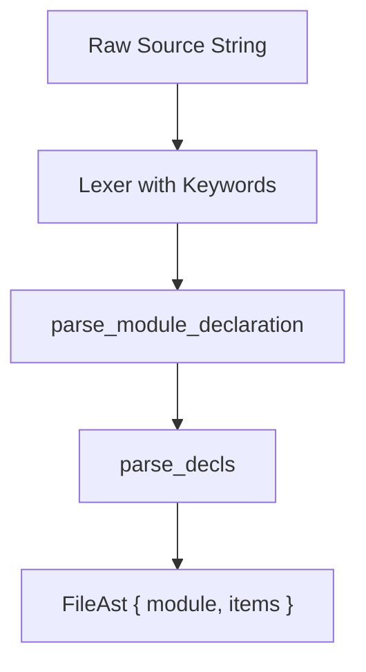

# Syntax and AST

The syntax and AST components process raw CHS source code into structured syntax representations using parser combinators.

## Overview / Context

The `syntax` crate tokenizes raw source files and constructs an Abstract Syntax Tree (AST). It relies on the `lex-just-parse` library for lexer and parser building blocks.

- **Lexer Initialization**: The lexer is initialized with a source string and configured with key keywords.
- **Parsing Entrypoint**: `parse_file` parses the module header first, then extracts a series of top-level declarations.
- **Parser Combinators**: The crate implements parser combinations (such as `many` and `try_parse!`) to cleanly build nested rules without manual backtracking.

> [!NOTE]
> Directives like `#distinct` and keywords like `autocast` are treated specially by the lexer and parser to support advanced language features.

---

## Detailed Steps / Components

The syntax of CHS is defined by top-level declarations, statements, and expressions.

### Key Syntax Enumerations

| AST Enum | Purpose | Represented Constructs |
| :--- | :--- | :--- |
| **`FileItem`** | Top-level module declarations. | Functions, imports, library binds, structs, enums, type definitions, operators, constants. |
| **`Stmt`** | Executable actions inside functions. | Expressions, blocks, variable declarations, loops, conditionals, defer, switch, return. |
| **`ExprKind`** | Value-producing operations. | Literals, function calls, member accesses, allocations, casts, drops, operators. |

### Component Breakdown

#### Top-Level Declarations (`FileItem`)
- **`Function`**: Houses signatures (parameters, return type) and function bodies.
- **`Import`**: Specifies imports of external modules (`import "runtime"`).
- **`Library`**: Declares foreign libraries with static/dynamic link names.
- **`Struct` & `Enum`**: Defines product types and variant sum types.
- **`Operator`**: Configures custom operator overloading rules.

#### Statements (`Stmt`)
- **`Defer`**: Schedules cleanup statements (`defer libc.free(ptr)`) executed on block exit.
- **`ForStmt` & `ForEach`**: Controls execution flow with conditional loops or iterator loops.
- **`Switch`**: Matches expressions against patterns, compiling down to efficient branches.

#### Expressions (`ExprKind`)
- **`Char`**: Character literals (e.g. `'a'`, `'\n'`, `'⚡'`) parsed via `lex-just-parse` v1.3.0. Character literals infer as `untyped_int`, allowing them to coerce automatically to `u8`, `i8`, `int`, etc., without explicit casts.
- **`New` & `Make`**: Performs dynamic allocations on the heap.
- **`Drop`**: Releases allocated resources explicitly.
- **`Cast` & `AutoCast`**: Performs explicit and automatic type coercion.
- **`InitList`**: Constructs structs inline (e.g. `Point.{ x: 10, y: 20 }`).

> [!TIP]
> The `Loc` struct tracks absolute token coordinates (file path, line, column) to provide precise error reporting across the entire compilation chain.

---

## Key Dependencies / Related Notes

- **[[CHS Compiler Architecture]]**: The central compiler pipeline note.
- **[[Type Checking and Semantics]]**: The type inference and unification rules applied to the parsed AST.
- **`lex-just-parse`**: The external lexing and parsing parser-combinator crate.
