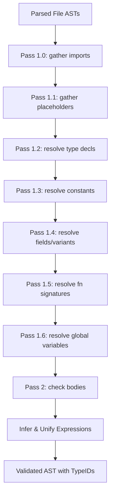

# Type Checking and Semantics

The type checking and semantics engine validates structure layouts, checks scope variables, and unifies types using a central database.

## Overview / Context

The `semantics` and `types` crates perform semantic verification on the AST. The compilation process employs a **Two-Pass Type Checking** strategy to support forward references and out-of-order declarations within modules:

- **Pass 1 (Modular Signature Gathering)**: Replaces the sequential per-file signature pass with 7 global phases orchestrated across all files and modules to ensure module-wide visibility of type definitions:
  - **Pass 1.0 (Gather Imports)**: Gathers module imports and declares foreign libraries.
  - **Pass 1.1 (Gather Placeholders)**: Registers name placeholders for structs and enums.
  - **Pass 1.2 (Resolve Type Decls)**: Maps type aliases and distinct types.
  - **Pass 1.3 (Resolve Constants)**: Evaluates and registers global constants module-wide.
  - **Pass 1.4 (Resolve Struct/Enum Fields)**: Resolves structures and enum variants, enabling variant defaults to reference previously resolved global constants.
  - **Pass 1.5 (Resolve Function Signatures)**: Registers function names and parameter signatures.
  - **Pass 1.6 (Resolve Global Variables)**: Infers types for thread-local and global variables.
- **Pass 2 (Check Bodies)**: Type-checks the actual statement blocks and expressions inside functions using resolved signatures.
- **Type Unification & Coercion**: Compares expected types against inferred types, resolving generic inference variables and handling coercion. Untyped literals (`untyped_int`) coerce to any integer type. Type alias resolutions are resolved recursively during comparison to avoid mismatching canonical primitive IDs with unresolved alias names.

> [!IMPORTANT]
> Unification will fail if two types cannot be merged. However, the checker supports **coercions** (such as array-to-slice conversions for parameters) which are resolved during unification.

---

## Detailed Steps / Components

### The Type Database (`TypeDatabase`)

#### Storage and Name Resolution

Inspired by Inko's type system design, `TypeDatabase` acts purely as an interning arena and storage container for types (`TypeID -> Type`), global function signatures (`FunctionID -> FunctionSignature`, see **[[FunctionID-Arena-And-Cached-Full-Names]]**), substitution tables, and module metadata. It does not maintain a global name-to-type map. Instead, individual `Module` structures handle the `Name => TypeID` mappings (for structs, enums, type aliases, and distinct types) scoped within their respective namespaces. Function signatures pre-compute and cache their qualified `full_name` strings when registered via `TypeDatabase::register_function`, assigning a unique global `FunctionID` for struct/enum method lookup tables and IR generation. Built-in scalar and integer types are exposed as constant `TypeID` values (`VOID_ID`, `BOOL_ID`, `INT_ID`, `U8_ID`, `USIZE_ID`, etc.) for direct lookup without hash table overhead.

### Semantic Checks & Scope Management

| Method | Role | Key Verification Action |
| :--- | :--- | :--- |
| **`push_scope` / `pop_scope`** | Variable Scoping | Manages local variable name bindings and visibility block-by-block. |
| **`unify`** | Equivalence Resolution | Unifies type constraints. Computes underlying type matches for pointers and functions. |
| **`coerce`** | Implicit Coercion | Converts specific arrays to slice types or adjusts integer size variables. Supports coercion of untyped integer constants to specific bit-width integers. |
| **`gather_*` / `resolve_*`** | Registration | Granular stages registering imports, placeholders, types, constants, struct/enum fields, function signatures, and global variables prior to checking function bodies. |

> [!TIP]
> The engine resolves operator overloads by looking up mapping keys built from the operator name and argument types, e.g., `Eq(NonEq, NonEq)`.

### Namespaced Type Resolution

To support modular codebases, types defined in imported modules are referenced using qualified type paths (e.g., `libc.FILE`).
- **Parsing**: Dotted identifiers in type positions are parsed as a single `Type::Scalar(Token)` with source name `"module_alias.TypeName"`. The parser avoids conflicts with initializer list dots (`Type.{...}`) by looking ahead to ensure the dot is followed by an identifier before consuming it.
- **Resolution**: During type mapping (`map_type`), qualified names are split. The module prefix is resolved against the current module's `imported_modules` aliases to determine the original module name. The type is then looked up directly within that module's registry in the `TypeDatabase`.

---

## Key Dependencies / Related Notes

- **[[CHS Compiler Architecture]]**: High-level compiler flow.
- **[[Syntax and AST]]**: Source nodes validated by this semantic phase.
- **[[Memory Management and Drop Safety]]**: Tracks resource allocation scopes and explicit `drop` operations.
- **[[Enum Access and Implicit Variants]]**: Qualified enum access and context-inferred variants.
